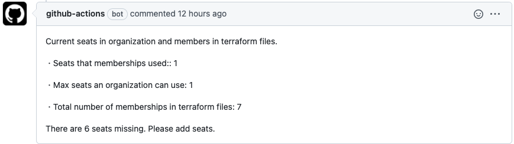

# OrganizationSeatsChecker

This action runs on pull requests to count GitHub organization members and membership written in terraform files.

## Examples


## Environment variables

### `GITHUB_PERSONAL_ACCESS_TOKEN`
Required. This token needs to have `read:org` scope to read organization information by octokit.

See https://docs.github.com/en/rest/reference/orgs#get-an-organization

### `MEMBERSHIP_FILE_PATH`
Required. This file path is an absolute file path to the terraform file containing the `github_membership` resources.

### `REPOSITORY_COLLABORATOR_FILE_PATH`
Required. This file path is an absolute file path to the terraform file containing the `github_repository_collaborator` resources.

### `ORGANIZATION_NAME`
Required. This organization name for which you want to count seats.

## Outputs
### `filled_seats`
Seats that membership used.
### `seats`
Max seats an organization can use.

### `member_count`
Total number of membership in the `github_membership` and `github_repository_collaborator` resources written in the terraform file.

## Example usage

```
on: [pull_request]

jobs:
  job:
    runs-on: ubuntu-latest
    name: A job to show seats
    steps:
      - uses: actions/checkout@v2

      - uses: ruby/setup-ruby@v1
        with:
          ruby-version: 2.7
          bundler-cache: true

      - name: Count seats and members
        id: seats_members
        uses: M-Yamashita01/organization-seats-checker@v0.1
        env:
          GITHUB_PERSONAL_ACCESS_TOKEN: ${{ secrets.ACCESS_TOKEN }}
          MEMBERSHIP_FILE_PATH: '${{ github.workspace }}/membership.tf' 
          REPOSITORY_COLLABORATOR_FILE_PATH: '${{ github.workspace }}/repository_collaborator.tf'
          ORGANIZATION_NAME: 'organization_name'

      - name: Post comments
        uses: actions/github-script@v5
        with:
          script: |
            var output = `Current seats in organization and members in terraform files.\n
              ・Seats that membership used:: ${{steps.seats_members.outputs.filled_seats}}\n
              ・Max seats an organization can use: ${{steps.seats_members.outputs.seats}}\n
              ・Total number of membership in terraform files: ${{steps.seats_members.outputs.member_count}}\n\n
            `
            const numberOfSeatsInShortage = ${{steps.seats_members.outputs.member_count}} - ${{steps.seats_members.outputs.seats}}
            var additional_message = `There is no shortage of seats.\n`
            if (numberOfSeatsInShortage > 0) {
              additional_message = `There are ${numberOfSeatsInShortage} seats missing. Please add seats.\n`
            }
            output += additional_message
            github.rest.issues.createComment({
              issue_number: context.issue.number,
              owner: context.repo.owner,
              repo: context.repo.repo,
              body: output
            })
```
